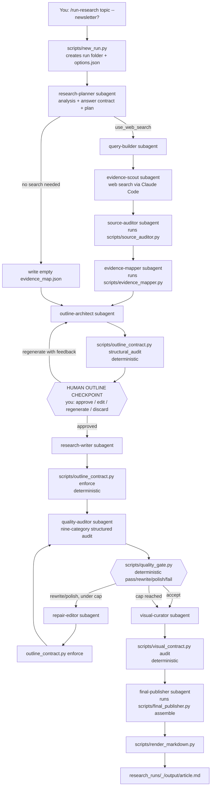

# SEARCH AI — Claude Code Edition — Architecture

SEARCH AI is a research and professional long-form content-generation
agent — not a social-media or LinkedIn tool. This edition is a faithful
architectural port of the API Edition's pipeline: the same
plan → research → outline → write → audit → repair → visualize → publish
flow, the same deterministic guardrails, the same delimited-markdown
article format. What's different is the execution model — every reasoning
step is a Claude Code **subagent** invoked by `/run-research` via the Task
tool, instead of a direct call to the Anthropic/Gemini APIs, and every
deterministic step is a small **stdlib-only CLI script** run by the
orchestrating command, instead of an in-process Python function called by
a FastAPI route.

## Design principles

(Identical to the API Edition — this is one product with two execution
shells, not two different tools.)

- **The outline is a contract.** Once you approve it, `scripts/
  outline_contract.py enforce` makes the final article's sections match it
  exactly — in code, not by asking a subagent nicely twice.
- **Models propose, code disposes.** Quality scores come from the
  quality-auditor subagent, but whether a run is PASS, PASS WITH WARNINGS,
  or FAIL — and whether another repair pass runs — is decided by fixed
  thresholds in `scripts/quality_gate.py`. A run that hits the repair cap
  reports its true final status; it never silently becomes "PASS."
- **The outline checkpoint is a hard stop.** `/run-research` will not
  invoke research-writer from an outline you haven't explicitly approved,
  edited, or regenerated with feedback — this is enforced by the
  orchestrating command's own instructions, not left to a subagent's
  judgment.
- **No fabricated numbers.** A visual is never inserted unless it can be
  built from labels/data that genuinely exist in the evidence or a file
  you attached — "no visual" is a valid, common, correct outcome.
- **Nothing extra to install.** Every deterministic script under
  `scripts/` is dependency-free, stdlib-only Python — no `pip install`,
  no virtualenv, no API key, no server. The only requirement is `python3`
  on your `PATH`.

## The pipeline, as Claude Code subagents + scripts



## Step by step

### 0. Set up the run

`/run-research <topic>` (add `--newsletter` for the second content type,
see below) runs `python3 scripts/new_run.py "<topic>"`, which scaffolds
`research_runs/<timestamp>_<slug>/` with `evidence/`, `outline/`,
`draft/`, `audit/`, `visuals/`, `output/` subfolders and `topic.txt`. The
orchestrating command then writes `<run>/options.json` (depth, audience,
`format`, web-research toggle, image-count cap), seeded from
`knowledge_base/research_profile.md`'s defaults wherever you've set an
opinion there.

### 1. Plan — `research-planner` subagent

Reads the topic, `knowledge_base/research_profile.md`,
`source_rules.md`, `content_rules.md`, and any files you attached (Claude
Code reads images/PDFs/text/code natively — no separate multimodal
parsing layer is needed the way the API Edition's `multimodal/` package
provides). Writes `analysis.json`, `contract.json` (the Answer Contract),
and `plan.json` (whether web search is warranted, and why).

### 2. Research (only if the plan calls for it)

`query-builder` turns the plan into 3-6 focused queries. `evidence-scout`
uses Claude Code's own web-search capability — never a paid external
search API — to gather findings, and is instructed to never invent a
source, product, statistic, or URL. `source-auditor` and `evidence-mapper`
are mechanical subagents: each just runs its matching deterministic script
(`scripts/source_auditor.py`, `scripts/evidence_mapper.py`) and reports
the result — no model judgment involved in dedup/credibility or evidence
numbering.

### 3. Outline — `outline-architect` subagent

Proposes a layout, 3-12 sections (or, in newsletter mode, an intro plus
one section per distinct evidence item — see below), each with a goal,
subpoints, key questions, a bridge from the previous section, and whether
it wants a visual, plus a one-sentence narrative thread. `scripts/
outline_contract.py structural_audit` then checks the proposed outline
itself — deterministically — against the answer contract before anyone
writes a word of prose.

### 4. Human checkpoint — mandatory

`/run-research` shows you the full outline (title, layout, every
section's title + goal + key questions) and stops. You approve it as-is,
edit it directly (small edits are applied by the orchestrating session
itself, not re-delegated to a subagent), ask for a feedback-driven
regeneration (written to `<run>/regenerate_feedback.txt` and re-run
through outline-architect), or discard the run entirely. Nothing after
this point runs without your explicit approval — silence or a vaguely
related follow-up message is never treated as approval.

### 5. Write — `research-writer` subagent

Writes the full report from the approved outline and mapped evidence, in
the same delimited-markdown format as the API Edition
(`=== TITLE ===` / `=== ABSTRACT ===` / `=== ANSWER ===` /
`=== TAKEAWAYS ===` / `=== SECTION: id | title ===`) — never JSON.
`scripts/outline_contract.py enforce` then fuzzy-matches the produced
sections back onto the outline, folds in anything extra, restores
anything missing, and reports an alignment score, without another model
call.

### 6. Audit + repair loop — capped at `MAX_ITERS` (default 4)

`quality-auditor` runs the same nine-category structured audit as the API
Edition (topic alignment, answer-contract coverage, evidence support,
citation integrity, source quality, depth, clarity, coherence,
redundancy) plus explicit unsupported-claims/invented-entities/drift
lists. `scripts/quality_gate.py` — pure deterministic logic, no model
call — decides accept / targeted rewrite / lighter polish / fail, and a
hard floor on citation-integrity and evidence-support failures can never
silently become "accept" just because the iteration cap was reached.
`repair-editor` makes the targeted fix, `outline_contract.py enforce` runs
again, and the loop returns to quality-auditor until accepted or capped.
A capped run is reported to you as its true final status.

### 7. Visuals — `visual-curator` subagent

Decides section by section whether a visual genuinely helps and, if so,
which archetype — never a forced, generic figure, and never a downloaded
photo. `scripts/visual_contract.py audit` then deterministically checks
every placed image has a caption, points at a real outline section id, no
section has two images of the same archetype, and the count stays under
the run's `image_count` cap — writing `<run>/visuals/visual_audit.json`.

### 8. Publish — `final-publisher` subagent

Runs `scripts/final_publisher.py assemble`, which maps `[E#]` evidence
markers to a deduplicated, numbered References list and strips any stray
model-written reference list or internal placeholder text — a report
should never show a literal `[E1]` to you. `scripts/render_markdown.py`
then produces the human-readable `output/article.md`.

### 9-10. Report back + research memory

`/run-research` tells you where the report landed, the final validation
status, repair-pass count, source count, visuals placed, and any warnings
(unsupported claims, invented entities, structural gaps, visual-audit
issues) — honestly, not just "done!" Periodically (every
`feedback_every_n` searches, tracked in `knowledge_base/
research_memory.md`'s frontmatter) it asks a low-friction feedback
question and, if you want it remembered, distils your answer into a
standing style/preference directive folded into every future run.

## Content types — Article vs Newsletter

`<run>/options.json`'s `format` field selects the outline shape —
everything else above (evidence gathering, the checkpoint, the
write/audit/repair loop, visual-curator, final-publisher, rendering) is
identical either way:

- `"format": "auto"` (default, "Article") — one deep-dive report; layout
  chosen by outline-architect to fit the topic and evidence.
- `"format": "newsletter"` (triggered by a leading `--newsletter` flag, or
  an unambiguous "this week's newsletter/digest/roundup on X" request) —
  one intro section plus one 60-150 word "what happened → why it matters
  → source" item per distinct piece of evidence found (typically 5-9).
  `ABSTRACT` stays empty, `TAKEAWAYS` become per-item quick-hits, and
  `wants_visual` defaults to false. `/run-research` also drops
  `image_count` to `1` for this mode, since a newsletter is skimmed, not
  illustrated.

Two scripts are newsletter-aware for this reason: `outline_contract.py`'s
minimum-depth-indicator check (every section needs subpoints or key
questions) is skipped for `layout == "newsletter"` — a newsletter item is
a short editorial blurb by design, not an analytical section — while every
other layout still enforces it in full; and `.claude/agents/visual-
curator.md` is instructed not to force a visual onto sections that
correctly opted out in newsletter mode. Nothing about scheduling,
publishing, hooks, or engagement is added anywhere — a generated
newsletter is a markdown document you review and send yourself, same as
an article.

## Subagents (`.claude/agents/`)

Eleven `.md` subagent definitions, each `model: inherit` (they use
whatever model your Claude Code session is running, no separate API key
or billing):

- **Reasoning specialists** — `research-planner`, `query-builder`,
  `evidence-scout`, `outline-architect`, `research-writer`,
  `quality-auditor`, `repair-editor`, `visual-curator`. These do the
  actual thinking; their instructions are the CC-edition equivalent of the
  API Edition's system prompts.
- **Mechanical wrappers** — `source-auditor`, `evidence-mapper`,
  `final-publisher`. Each just runs its one deterministic script against
  the run folder's files and reports the result — no independent judgment.

## Deterministic scripts (`scripts/`)

Dependency-free, stdlib-only Python, sharing a tiny `_jsonio.py` helper
(`read_json`, `write_json`, `die`, `usage`) so every script has the same
CLI shape (`python3 <script>.py <subcommand> <args...> <out.json>`):

- `new_run.py` — scaffolds a run folder.
- `answer_contract.py` — Answer Contract shape helpers.
- `source_auditor.py` — dedupe by normalized source domain, flag
  single-source claims.
- `evidence_mapper.py` — maps findings into numbered `[E#]` evidence
  claims.
- `outline_contract.py` — `structural_audit` (pre-write) and `enforce`
  (post-write), the same "outline is a contract" logic as the API
  Edition's `guardrails/outline_contract.py`, newsletter-aware as above.
- `article_format.py` — parses the delimited-markdown format
  research-writer/repair-editor write into a structured article dict.
- `quality_gate.py` — fixed-threshold accept/rewrite/polish/fail decision
  layer, identical logic to the API Edition's `guardrails/quality_gate.py`.
- `visual_contract.py` — post-visual-curator structural check (captions,
  valid section ids, no duplicate archetypes per section, under the image
  cap) — the CLI-wrapped counterpart of `guardrails/visual_contract.py`.
- `visual_engine.py` — deterministic SVG figure generation from real
  labels/data — no external photo search or download.
- `final_publisher.py` — assembles the References list from the evidence
  map, strips stray `[E#]` markers and model-written reference lists.
- `render_markdown.py` — turns the final article JSON into the
  human-readable `output/article.md`.

## Slash commands (`.claude/commands/`)

- `/setup` — one-time conversational interview that fills in
  `knowledge_base/research_profile.md`, `source_rules.md`, and
  `content_rules.md` (and `writing_samples.md` if you give it a sample).
- `/run-research <topic> [--newsletter]` — the orchestrator described
  above.
- `/start-ui` — launches `ui/server.py` in the background and hands off
  to the browser dashboard (see below).
- `/review-memory` — view or edit `knowledge_base/research_memory.md`
  directly.
- `/add-writing-sample` — add a voice sample outside the setup interview.
- `/add-research-rule` — add a standing source/content rule outside the
  periodic feedback prompt.

## Permissions (`.claude/settings.json`)

```json
{
  "permissions": {
    "allow": [
      "Bash(python3 *)",
      "PowerShell(python3 *)",
      "Edit(**)",
      "WebFetch",
      "WebSearch"
    ]
  }
}
```

Each rule is scoped to exactly what the pipeline actually invokes, not a
blanket bypass:

- `Bash(python3 *)` / `PowerShell(python3 *)` — every deterministic step
  in `scripts/` is always invoked as `python3 <script>.py ...`; the
  PowerShell form matters because native Windows without Git for Windows
  installed runs shell commands through Claude Code's PowerShell tool
  instead of Bash. Nothing broader than a `python3`-prefixed command is
  pre-approved — an agent trying to run an arbitrary other shell command
  still prompts normally.
- `Edit(**)` — covers Claude Code's built-in file-writing tools (Write,
  Edit, NotebookEdit are all governed by `Edit` rules, per Claude Code's
  own permission model) for paths under this project folder only,
  anchored the same way `outline/**` or `research_runs/**` would be. It
  does not grant edit access anywhere outside this folder.
- `WebFetch` / `WebSearch` — evidence-scout's whole job is retrieving
  content from sources it discovers at runtime, so per-domain allowlisting
  isn't practical here the way it would be for a fixed set of trusted
  domains. This is the one rule in this file that's genuinely broad by
  necessity, not an oversight.

**This only takes effect after Claude Code's one-time folder-trust
dialog is accepted, and that dialog only appears in an interactive
session** — never in headless mode (`-p`), which is what the dashboard
below uses. Practically: run `claude` normally in this folder once after
unzipping, accept the trust prompt if one appears, and both interactive
`/run-research` calls and dashboard-driven ones will honor these rules
from then on. Skipping this step doesn't break anything — it just means
more individual permission prompts than necessary.

## Browser dashboard (`ui/server.py`)

A stdlib-only local HTTP server (`http.server.ThreadingHTTPServer` +
`subprocess`, no third-party dependencies) providing a topic box, a
START button, live progress, and outline approve/regenerate/discard
buttons at `http://127.0.0.1:8787`. It is a thin control layer around
Claude Code's own headless mode — it does not reimplement, bypass, or
duplicate any part of the pipeline described above:

- **Start** — `POST /api/start {topic, newsletter}` shells out to
  `claude -p "/run-research [--newsletter] <topic>" --output-format json`
  in a background thread and returns a `run_id` immediately. This is the
  exact same command typing `/run-research <topic>` in an interactive
  session sends — headless mode just runs it non-interactively and
  returns when the turn ends.
- **Outline checkpoint** — `/run-research`'s own instructions stop and
  present the outline after research, same as always; in headless mode
  that's simply where the single turn ends and `claude -p` returns. The
  server reads `<run>/outline/outline.json` (whose shape it already
  knows) to render the outline, and separately captures the CLI's
  `session_id` from the JSON response.
- **Approve / regenerate** — `POST /api/decision/{run_id}` sends a follow
  -up message via `claude -p "<message>" --resume <session_id>`, which
  continues the *same* conversation with full context (Claude Code's
  documented session-resume mechanism) — from the model's perspective
  this is just the next user turn, identical to typing a reply in the
  terminal. Approving sends an explicit instruction to proceed through
  writing/audit/repair/visuals/publish without stopping again;
  regenerating sends your feedback text, mirroring `/run-research`'s
  existing outline-regeneration path.
- **Progress while a call blocks** — since each `claude -p` call runs
  synchronously to completion, a background polling thread infers a
  cosmetic "stage" label purely from which files exist yet in the
  discovered run folder (`evidence/` → researching, `outline/
  outline.json` → outline ready, `draft/` → writing, `audit/` →
  auditing/repairing, `visuals/` → adding visuals, `output/article.md` →
  finalizing). This is cosmetic only — real status transitions
  (`awaiting_decision`, `done`, `error`) are driven by whether the
  subprocess has actually exited and what it returned, never by file
  presence alone; the server never claims a run is `done` without finding
  `output/article.md` on disk.
- **Never fails silently** — a missing `claude` binary, a `-p` call that
  exits non-zero, or unparseable output all become an explicit `error`
  status with the raw stderr available in the UI's debug panel, rather
  than a hung spinner or a crashed server process.

**Honesty about maturity:** this is a new convenience layer built on top
of two real but less-exercised CLI behaviors (`--output-format json`'s
exact fields, and `--resume` correctly continuing a stopped conversation)
— it has not been road-tested the way `/run-research` typed directly into
Claude Code has, across as many real runs. Every run's debug panel
surfaces the `session_id` and the exact `claude --resume <session_id>`
command needed to continue that same conversation by hand in a terminal,
specifically so the dashboard is never a dead end if it misbehaves.

## Knowledge base (`knowledge_base/`)

Plain markdown, readable and hand-editable at any time — this is your
standing research profile, not a database: `research_profile.md`
(depth/audience/format defaults), `source_rules.md` (preferred/avoided
sources), `content_rules.md` (formatting/banned-pattern/structural rules),
`writing_samples.md` (voice references), `research_memory.md` (distilled
style/preference directives plus the feedback-cadence frontmatter), and
`feedback_log.md` (raw feedback history).

## What's intentionally different from the API Edition

- **No token-usage ledger.** Claude Code sessions don't expose per-call
  token accounting the way a direct Anthropic/Gemini API integration does,
  so there is no TOKEN box equivalent here.
- **No provider layer, no API keys, no `.env`.** Every reasoning step runs
  as a subagent inside your existing Claude Code session — whatever model
  that session uses is what SEARCH AI uses.
- **No multimodal intake package.** Claude Code already reads
  images/PDFs/text/code natively; there's no separate parsing layer to
  maintain the way the API Edition's `multimodal/` package provides for a
  from-scratch web backend.
- **No exports package, no browser UI.** The deliverable is the rendered
  markdown file at `<run>/output/article.md`; convert it with your own
  tools (or ask Claude Code directly) if you want a Word/PDF copy.

Everything else — the pipeline order, the guardrail philosophy, the
article format, the content-type split — is the same design, ported to a
different execution shell.
